# Cursor Source Info

|                               Bibata Modern Cursors                               |                               Bibata Original Cursors                               |         Source          |         Symbolic links          | Windows Cursor name |
| :-------------------------------------------------------------------------------: | :---------------------------------------------------------------------------------: | :---------------------: | :-----------------------------: | :-----------------: |
|                 |        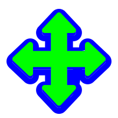         |        move.svg         | `dnd_none.svg` `all_scroll.svg` |    `SizeAll.cur`    |
|   |   | bottom_left_corner.svg  |             `None`              |                     |
|      |      |   fd_double_arrow.svg   |             `None`              |   `SizeNWSE.cur`    |
|     |     |  top_right_corner.svg   |             `None`              |                     |
|  |  | bottom_right_corner.svg |             `None`              |                     |
|      |      |   bd_double_arrow.svg   |             `None`              |   `SizeNESW.cur`    |
|      |      |   top_left_corner.svg   |             `None`              |                     |
|           |     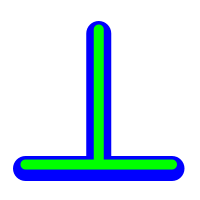      |     bottom_tee.svg      |             `None`              |                     |
|           |           |     center_ptr.svg      |             `None`              |                     |
|               |       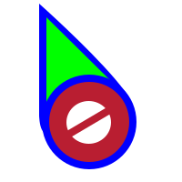        |       circle.svg        |             `None`              |      `NO.cur`       |
|       |       |   crossed_circle.svg    |             `None`              |                     |
|          |     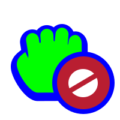     |     dnd_no_drop.svg     |             `None`              |                     |
|         |         |    context_menu.svg     |             `None`              |                     |
|                 |                 |        copy.svg         |             `None`              |                     |
|             |             |      dnd_copy.svg       |             `None`              |                     |
|        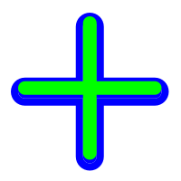        |                |        cross.svg        |             `None`              |                     |
|               |       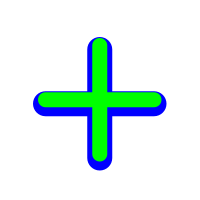        |       tcross.svg        |             `None`              |                     |
|            |            |      crosshair.svg      |             `None`              |     `Cross.cur`     |
|               |               |       dotbox.svg        |             `None`              |                     |
|                |                |        hand1.svg        |             `None`              |                     |
|                |                |        hand2.svg        |             `None`              |     `Hand.cur`      |
|             |      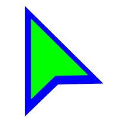       |      left_ptr.svg       |             `None`              |     `Arrow.cur`     |
|            |            |      left_side.svg      |             `None`              |                     |
|           |           |     right_side.svg      |             `None`              |                     |
|             |      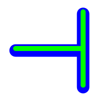       |      left_tee.svg       |             `None`              |                     |
|                 |        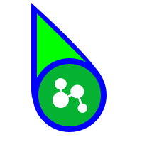         |        link.svg         |             `None`              |                     |
|             |             |      dnd_link.svg       |             `None`              |                     |
|             |      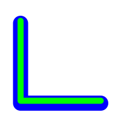       |      ll_angle.svg       |             `None`              |                     |
|             |             |      lr_angle.svg       |             `None`              |                     |
|             |      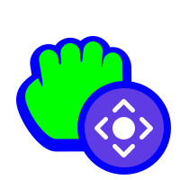       |      dnd_move.svg       |             `None`              |                     |
|             |             |      grabbing.svg       |             `None`              |                     |
|         |    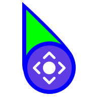     |    pointer_move.svg     |             `None`              |                     |
|               |               |       pencil.svg        |             `None`              |  `Handwriting.cur`  |
|                 |                 |        plus.svg         |             `None`              |                     |
|       |       |   question_arrow.svg    |             `None`              |     `Help.cur`      |
|              |              |       dnd_ask.svg       |             `None`              |                     |
|            |            |      right_ptr.svg      |             `None`              |                     |
|      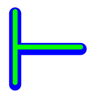      |            |      right_tee.svg      |             `None`              |                     |
|        |        |    sb_down_arrow.svg    |             `None`              |                     |
|    |  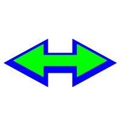  |  sb_h_double_arrow.svg  |             `None`              |    `SizeWE.cur`     |
|        |        |    sb_left_arrow.svg    |             `None`              |                     |
|       |       |   sb_right_arrow.svg    |             `None`              |                     |
|          |          |     sb_up_arrow.svg     |             `None`              |   `Alternate.cur`   |
|    |  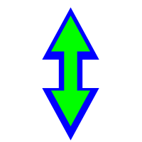  |  sb_v_double_arrow.svg  |             `None`              |    `SizeNS.cur`     |
|             |      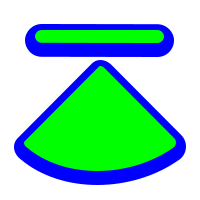       |      top_side.svg       |             `None`              |                     |
|     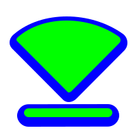     |          |     bottom_side.svg     |             `None`              |                     |
|              |       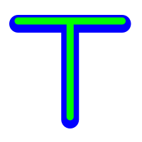       |       top_tee.svg       |             `None`              |                     |
|             |             |      ul_angle.svg       |             `None`              |                     |
|             |      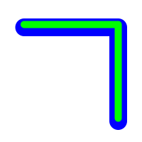       |      ur_angle.svg       |             `None`              |                     |
|        |    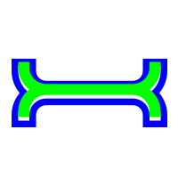    |    vertical_text.svg    |             `None`              |                     |
|               |               |        wait.svg         |             `None`              |     `Wait.ani`      |
|     |     |   left_ptr_watch.svg    |             `None`              |  `AppStarting.ani`  |
|       |       |   wayland_cursor.svg    |             `None`              |                     |
|             |             |      x_cursor.svg       |             `None`              |                     |
|                |                |        xterm.svg        |             `None`              |     `IBeam.cur`     |
|              |              |       zoom_in.svg       |             `None`              |                     |
|             |             |      zoom_out.svg       |             `None`              |                     |

## Figma File

