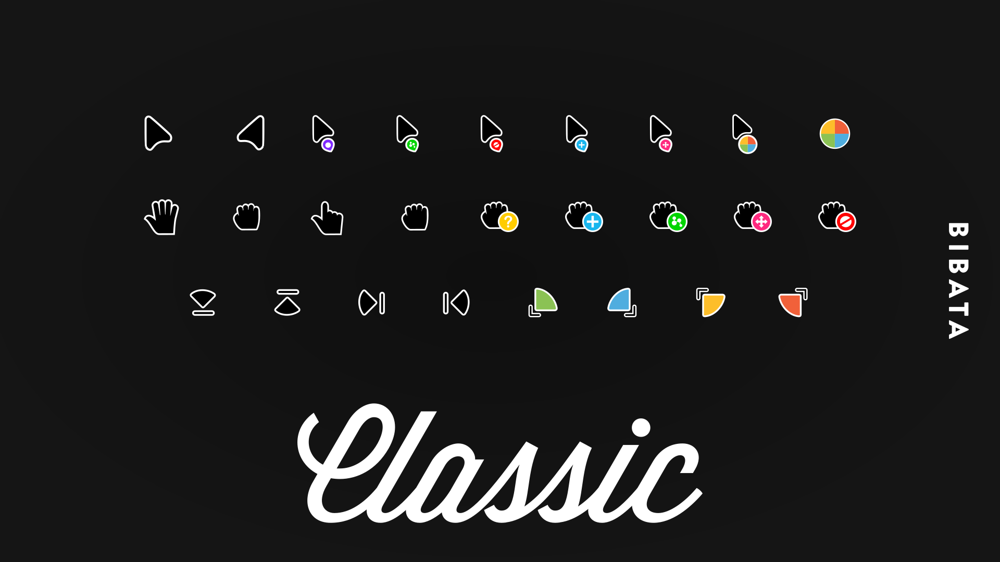
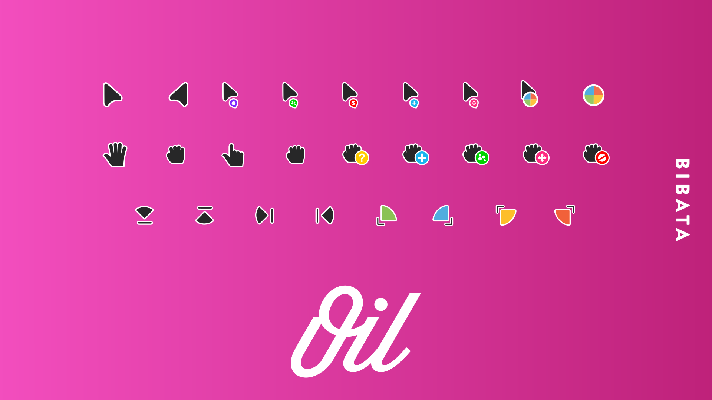
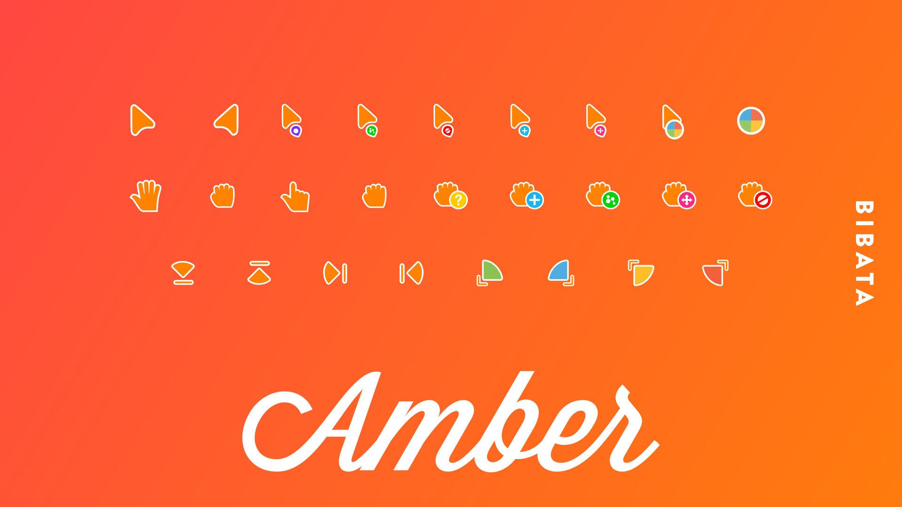

<h1 align="center">
  
  <br>
  
</h1>

<h4 align="center">🚀 Material Based Cursor 🏳️‍🌈</h4>

<p align="center">


<!-- <a href="#">
  
</a> -->

<br>


<br>

<a href="https://github.com/KaizIqbal/Bibata_Cursor/releases" target="_blank">
  
</a>
<a href="https://aur.archlinux.org/packages/bibata-cursor-theme" target="_blank">
  
</a>
<a href="https://www.paypal.me/KaizKhatri" target="_blank">
  
</a>
<br>
<a href="https://twitter.com/ful1e5_" target="_blank">
  
</a>
<a href="https://github.com/KaizIqbal" target="_blank">
  
</a>
<a href="https://mastodon.social/web/accounts/580173" target="_blank">
  
</a>
</p>

<p align="center">
  <a href="#bibata-?">Bibata</a> •
  <a href="#install">Install</a> •
  <a href="#windows">Windows</a> •
  <a href="#preview">Preview</a> •
  <a href="./CONTRIBUTING.md#Contributors" target="_blank">Contributors</a> •
  <a href="#credit">Credit</a> •
  <a href="#support">Support</a> •
  <a href="https://github.com/KaizIqbal/Bibata_Cursor/blob/master/LICENSE">License</a>
</p>

## Bibata ?

Bibata is **OpenSource** ,Compact and Material Designed Cursor set.This project masterelop for improve `Cursor` Experience.

### Build dependencies

- [git](https://git-scm.com/)
- [python3](https://www.python.org/)
- [pip](https://pypi.org/project/pip/)/[python-pillow](https://www.archlinux.org/packages/community/x86_64/python-pillow/)
- [Inkscape](https://inkscape.org/)
- [Xcursorgen](https://www.x.org/releases/X11R7.7/doc/man/man1/xcursorgen.1.xhtml)

### Install dependencies

**📝Note**: Snap/Flatpak packages raise issue in build(e.g. inkscape).

##### Debain/Ubuntu

```
sudo apt install git python3 python3-pip inkscape x11-apps
```

##### Fedora

```
sudo dnf install git python37 python3-pip inkscape xcursorgen
```

##### ArchLinux

```
# Packages
sudo pacman -S git python inkscape xorg-xcursorgen

# AUR package with yaourt
yaourt -S python-pillow

```

##### Manjaro

**📝Note**: enable AUR in ManjaroLinux for [python-pillow](https://www.archlinux.org/packages/community/x86_64/python-pillow/)

```
pamac install git python python-pillow inkscape xorg-xcursorgen
```

Install `python-pip` package in case python-pillow cause error or not installed on your arch based distro.

```
# Archlinux
sudo pacman -S python-pip

# Manjaro
pamac python-pip
```

## Install

### Basic Installation

Bibata cursor is installed by running one of the following commands in your terminal. You can install this via the command-line with either `curl` or `wget`.

##### via curl

```shell
sh -c "$(curl -fsSL https://raw.githubusercontent.com/KaizIqbal/Bibata_Cursor/master/Bibata.sh)"
```

##### via wget

```shell
sh -c "$(wget -O- https://raw.githubusercontent.com/KaizIqbal/Bibata_Cursor/master/Bibata.sh)"
```

Latest `Stable` & `Development` releases can be downloaded from [Here](https://github.com/KaizIqbal/Bibata_Cursor/releases)

### Packages📦

**📝Note**: If you're having trouble with the packages please submit a request to the package maintainer before creating an issue.

#### Archlinux

Arch Linux users can install from the [AUR](https://aur.archlinux.org/packages/bibata-cursor-theme/) currently maintained by [_@Shatur_](https://aur.archlinux.org/packages/?K=Shatur&SeB=m).
Arch Linux users can install the theme collection from the AUR repository by using the yaourt or packer commands below.

Yaourt commands:

```
yaourt -S bibata-cursor-theme

```

Packer commands:

```
packer -S bibata-cursor-theme

```

#### Fedora

Fedora users can install from the [copr-repo](https://copr.fedorainfracloud.org/coprs/muhalantabli/copr-repo/) currently maintained by _@muhalantabli_.

enable the repo:

```
sudo dnf copr enable muhalantabli/copr-repo

```

installation commands:

```
sudo dnf install bibata-cursor-theme

```

#### Manjaro linux

Pamac commands:

```
pamac install bibata-cursor-theme

```

<!--
From https://github.com/Silicasandwhich/Bibata_Cursor_Translucent#windows -->

#### Windows

1. Get the lastest stable/dev-version Windows release from the [releases tab](https://github.com/KaizIqbal/Bibata_Cursor/releases) on the github page.

2. Open the settings app

3. Go to Devices -> Mouse -> Additional Mouse Options

4. Go to the pointers tab

5. Replace each cursor in the currently applied cursor set with the corresponding cursor in the Windows folder of your desired flavor

6. Click "save as" and type in the desired name

7. Click "apply" and "ok"

### Manual Installation

1. Make sure you have installed all [Build dependencies](#build-dependencies).

2. Build & Install:
   ```shell
   git clone https://github.com/KaizIqbal/Bibata_Cursor.git
   cd Bibata_Cursor/
   chmod +x build.sh
   ./build.sh
   chmod +x ./install.sh
   ```
   Install (available for all users)
   ```shell
   sudo ./install.sh
   ```
   Install (available only for local eser)
   ```
   ./install.sh
   ```
3. Uninstall:

   Using `Script` :

   ```shell
   #From All Users
   sudo ./install.sh
   #From Local User
   ./install.sh
   ```

   Without `Script` :

   ```shell
   #From All Users
   $sudo rm -r /usr/share/icons/Bibata_*
   #from Local User
   $rm -r ~/.icons/Bibata_*
   #Note : Your replace * with flavor Name to remove individual
   ```

More information about script is found in [src](./src/README.md) directory.

## Preview

<p align="center">
</br><sub>Bibata Classic</sub></p>

<p align="center">
</br><sub>Bibata Oil</sub></p>

<p align="center">
</br><sub>Bibata Ice</sub></p>

<p align="center">
</br><sub>Bibata Amber</sub></p>

## You may also like...

- [**Bibata Extra**](https://github.com/KaizIqbal/Bibata_Extra_Cursor) - More Bibata!
- [**Bibata Adapta**](https://gitlab.com/cscs/Bibata_AdaptaBreath_Cursors) - Bibata Based Cursor Made for AdaptaBreath and Manjaro.
- [**Bibata Translucent**](https://github.com/Silicasandwhich/Bibata_Cursor_Translucent) - Bibata translucent is a translucent flavor of the Bibata.

## Bugs

Bugs should be reported [here](https://github.com/KaizIqbal/Bibata_Cursor/issues) on the Github issues page.

## Getting help

You can create a issue, I will help you.

## Contributions and Suggestions

<a href="https://github.com/KaizIqbal/Bibata_Cursor/graphs/contributors">
  
</a>

Check [CONTRIBUTING.md](./CONTRIBUTING.md),any suggestions for features and contributions to the continuing code masterelopment can be made via the issue tracker or code contributions via a `Fork` & `Pull requests`.

###

## Credit

- [Adwaita](https://github.com/GNOME/adwaita-icon-theme)
- [Dmz](https://github.com/GalliumOS/dmz-cursor-theme)
- [Yaru](https://github.com/ubuntu/yaru)
- Emojis are taken from [here](https://emojipedia.org/)

## Support

**Give a ❤️**

**OR**

<a href="https://www.buymeacoffee.com/Nt7Wg4V" target="_blank">

</a>
<br><br>
<a href="https://www.patreon.com/bePatron?u=13184396" target="_blank">

</a>
<br><br>
<a href="https://www.pling.com/p/1197198/" target="_blank">

</a>

<p align="center">
  <h1 align="center">.^.</h1>
</p>
